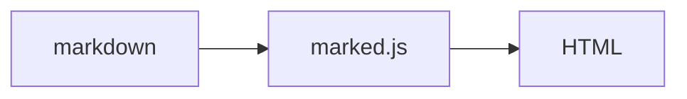

# mdpeek 自测

普通段落、**加粗**、`inline code`。

## 表格

| 列A | 列B |
|---|---|
| 1 | 2 |

## 代码

```rust
fn main() { println!("hi"); }
```

## Mermaid


```mermaid
graph LR
  A[markdown] --> B[marked.js] --> C[HTML]
```

- [x] 任务列表
- 中文渲染

## 自动刷新测试 - 12:57:05
